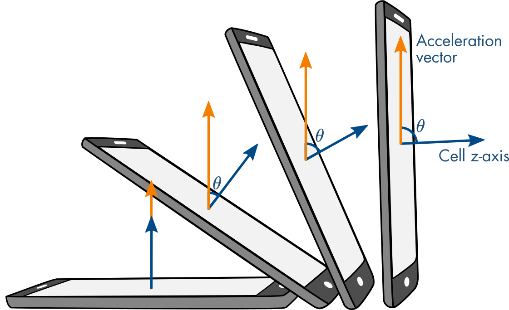
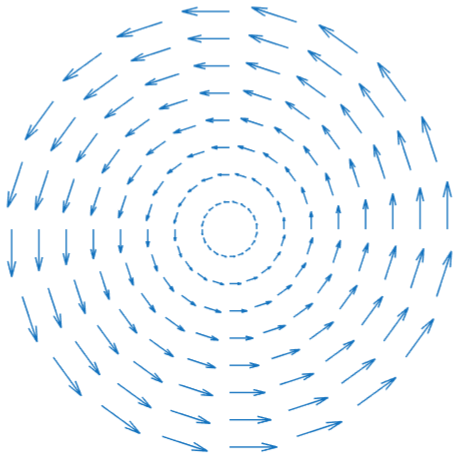
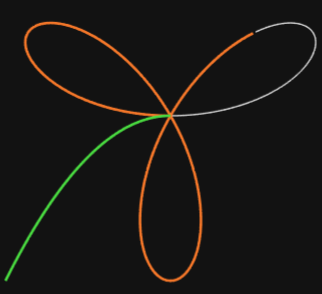

# Multivariable: Space and Functions

 or 

**Curriculum Module**

_Created with R2025a. Compatible with R2024a and later releases._

# Information

This curriculum module contains interactive [MATLAB® live scripts](https://www.mathworks.com/products/matlab/live-editor.html) that teach and apply standard concepts related to representing two and three\-dimensional space.

## Background

You can use these live scripts as demonstrations in lectures, class activities, or interactive assignments outside class. This module covers coordinate systems, vector fields, and parametric equations. It also includes applications to electrical and gravitational attraction, electric and magnetic field diagrams, and robotic path planning.

The instructions inside the live scripts will guide you through the exercises and activities. Get started with each live script by running it one section at a time. To stop running the script or a section midway (for example, when an animation is in progress), use the  Stop button in the **RUN** section of the **Live Editor** tab in the MATLAB Toolstrip.

## Contact Us

Solutions are available upon instructor request. Contact the [MathWorks teaching resources team](mailto:onlineteaching@mathworks.com) if you would like to request solutions, provide feedback, or if you have a question.

## Prerequisites

This module assumes knowledge of vector arithmetic, including the dot product and cross product, Cartesian coordinate systems, and trigonometry.

| **Courseware Module**    | **Sample content**    | **Available on:**     |
| :-- | :-- | :-- |
| [**Vector Arithmetic**](https://www.mathworks.com/matlabcentral/fileexchange/94555-vector-arithmetic)    |     |        [GitHub](https://github.com/MathWorks-Teaching-Resources/Vector-Arithmetic)      |

## Getting Started
### Accessing the Module
### **On MATLAB Online:**

Use the  link to download the module. You will be prompted to log in or create a MathWorks account. The project will be loaded, and you will see an app with several navigation options to get you started.

### **On Desktop:**

Download or clone this repository. Open MATLAB, navigate to the folder containing these scripts, and double\-click [Space.prj](<matlab: openProject("Space.prj")>). It will add the appropriate files to your MATLAB path and open an app asking where you would like to start. 

Ensure you have all the required products ([listed below](#H_E850B4FF)) installed. If you need to include a product, add it using the Add\-On Explorer. To install an add\-on, go to the **Home** tab and select   **Add-Ons** > **Get Add-Ons**. 

## Products

MATLAB® and Symbolic Math Toolbox™ are used throughout. Tools from the Mapping Toolbox™ are used in the Further Exploration in the [CoordinateSystems](#M_0493) script and for geographical plotting in the VectorFields script. 

# Scripts

## [**CoordinateSystems.mlx**](https://matlab.mathworks.com/open/github/v1?repo=MathWorks-Teaching-Resources/Multivariable-Space-and-Functions&project=Space.prj&file=Scripts/CoordinateSystems.mlx) 
||||
| :-- | :-- | :-- |
|     | **In this script, students will...**   $\bullet$ Use polar, spherical, cartesian, and cylindrical coordinates to identify points, curves, surfaces, and volumes in space.   $\bullet$ Convert points, curves, surfaces, and volumes between different coordinate representations.   $\bullet$ Choose coordinate systems to describe given geometric objects and explain their choice.    | **Academic disciplines**   $\bullet$ Electrical Engineering   $\bullet$ Mechanical Engineering   $\bullet$ Navigation   $\bullet$ Mathematics     |

## [**VectorFields**](https://matlab.mathworks.com/open/github/v1?repo=MathWorks-Teaching-Resources/Multivariable-Space-and-Functions&project=Space.prj&file=Scripts/VectorFields.mlx)
||||
| :-- | :-- | :-- |
|     | **In this script, students will...**   $\bullet$ Visualize 2D and 3D vector fields   $\bullet$ Visualize 2D and 3D contour plots  | **Academic disciplines**   $\bullet$ Electrical Engineering   $\bullet$ Mechanical Engineering   $\bullet$ Physics   $\bullet$ Meteorology   $\bullet$ Mathematics     |

## **ParametricEquations (planned)**
||||
| :-- | :-- | :-- |
|     | **In this script, students will...**   $\bullet$ Identify a parametric expression for a given path in space.   $\bullet$ Visualize a path given as a parametric equation.   $\bullet$ Explore applications of parametric equations to represent space\-time data    | **Academic disciplines**   $\bullet$ Navigation   $\bullet$ Robotics   $\bullet$ Mathematics     |

# License

The license for this module is available in the [LICENSE.md](https://github.com/MathWorks-Teaching-Resources/Multivariable-Space-and-Functions/blob/release/LICENSE.md).

# Related Courseware Modules

| **Courseware Module**    | **Sample Content**    | **Available on:**     |
| :-- | :-- | :-- |
| [**Electricity & Magnetism: Introduction**](https://www.mathworks.com/matlabcentral/fileexchange/180193-electricity-magnetism-introduction)    |     |       [GitHub](https://github.com/MathWorks-Teaching-Resources/Electricity-Magnetism)     |
| [**Applied Partial Differential Equations**](https://www.mathworks.com/matlabcentral/fileexchange/172650-applied-partial-differential-equations)    |     |       [GitHub](https://github.com/MathWorks-Teaching-Resources/Applied-PDEs)     |

Or feel free to explore our other [modular courseware content](https://www.mathworks.com/matlabcentral/fileexchange/?q=tag%3A%22courseware+module%22&sort=downloads_desc_30d).

# Educator Resources
-  [Educator Page](https://www.mathworks.com/academia/educators.html) 

# Contribute 

Looking for more? Find an issue? Have a suggestion? Please contact the [MathWorks teaching resources team](mailto:%20onlineteaching@mathworks.com). If you want to contribute directly to this project, you can find information about how to do so in the [CONTRIBUTING.md](https://github.com/MathWorks-Teaching-Resources/Multivariable-Space-and-Functions/blob/release/CONTRIBUTING.md) page on GitHub.

*©* Copyright 2025 The MathWorks, Inc

